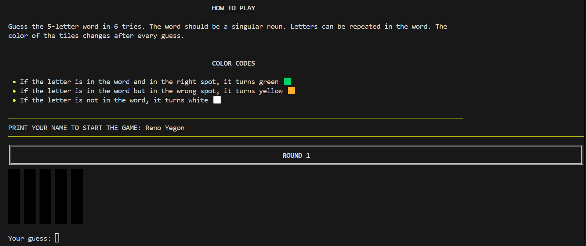

# Py.word Game
Welcome to Py.word Game — a terminal-based, Wordle-style game implemented in Python, featuring word validation!

This terminal version of the Wordle game

#### Py.word Game snippet:


## Table of Contents
- [Py.word Game](#pyword-game)
      - [Py.word Game snippet:](#pyword-game-snippet)
  - [Table of Contents](#table-of-contents)
  - [Project Overview](#project-overview)
  - [Game Rules](#game-rules)
  - [Error Prevention and Added Features](#error-prevention-and-added-features)
  - [Key Features](#key-features)
  - [Installation](#installation)
  - [Tech used](#tech-used)
  - [Main files](#main-files)
  - [Required Libraries](#required-libraries)
  - [What Can Be Improved and Future Enhancements](#what-can-be-improved-and-future-enhancements)
  - [Contributions](#contributions)
    - [Contribution Guidelines](#contribution-guidelines)

## Project Overview

[(Back to Table of Contents)](#table-of-contents)

This project is a terminal-based Wordle-style game implemented in Python. The game challenges users to guess a randomly selected 5-letter singular noun within six attempts. It features colored feedback for each guess, input validation, and integration with the Free Dictionary API to ensure guesses are valid singular nouns.


## Game Rules
[(Back to Table of Contents)](#table-of-contents)

1. The game displays instructions and rules using rich-formatted markdown.
2. The user enters their name to start, and the stopwatch begins.
3. For each round (up to 6), the user inputs a guess, which is validated and checked against the target word.
4. After each guess, the game displays colored feedback and updates the guess distribution.
5. The game ends when the user guesses the word or exhausts all attempts, displaying the result, total time (with penalties for wrong guesses), and the emoji summary.
6. The user can choose to play again or exit.

## Error Prevention and Added Features

[(Back to Table of Contents)](#table-of-contents)

In this program I tried to prevent potential mistakes and added some features.
1. A target word (which user should guess) is picked randomly from the .txt file with 5-letter nouns.
2. The user's guess word is checked to be a 5-letter word.
3. The user's guess word is checked to be a singular noun in [Free Dictionary API](https://dictionaryapi.dev/).
4. Identical letters in words are controlled. For example, in a guess word there are two identical letters (letter *a* in the word *award*). The target word is *brain*. So, in the program the first letter *a* turns white (not yellow) and the second *a* turns green (because it is in the right spot).
5. After printing the user's name a stopwatch starts and goes till the victory or last try.
6. After each guess, the user sees colored feedback for their attempt:
    - If a letter is in the correct position, it is shown as green 🟩.
    - If a letter is in the word but in the wrong position, it is shown as yellow 🟨.
    - If a letter is not in the word, it is shown as white ⬜.

## Key Features
[(Back to Table of Contents)](#table-of-contents)

- **Random Word Selection:** The target word is randomly chosen from a file containing 5-letter nouns.
- **Input Validation:** Ensures guesses are alphabetic, exactly 5 letters, and valid singular nouns using the Free Dictionary API.
- **Colored Feedback:** Uses the `rich` library to display colored tiles indicating correct letters (green), misplaced letters (yellow), and incorrect letters (white).
- **Duplicate Letter Handling:** Correctly manages repeated letters in guesses and target words.
- **Timing:** A stopwatch tracks the duration of each game session.
- **Guess Distribution:** At the end of the game, users can view and copy their guess distribution represented with emojis.
- **Replay Option:** After each game, users are prompted to play again or exit.


## Installation
[(Back to Table of Contents)](#table-of-contents)

Clone the repository to your local machine:
git clone git clone
``` 
https://github.com/RENOYEGON/py.word-game.git
```

Navigate to the project directory
```
cd py.word-game
```

It's recommended to first create a python virtual environment and Install the required libraries by running the following command:
```
pip3 install -r requirements.txt
```

Then run the command:
```
python project.py
```

## Tech used
Python 3.13.1

## Main files
[(Back to Table of Contents)](#table-of-contents)
- project.py - main file with the game
- test_project.py - three tests of the main program's functions
- five-letter-words.txt - the list with 5-letter nouns.

## Required Libraries
[(Back to Table of Contents)](#table-of-contents)

This project relies on the following pip-installable libraries, which is listed one per line in a requirements.txt file in the root of the directory: 
The following libraries are required for `project.py`:

- **random**: Standard library module for random word selection.
- **requests**: For making HTTP requests to the Free Dictionary API to validate user guesses.
- **rich**: For enhanced terminal output, including colored feedback and markdown rendering.
- **time**: Standard library module used for timing and stopwatch functionality.
- **sys**: Standard library module for system-specific parameters and functions.
- **os**: Standard library module for interacting with the operating system.
- `stopwatch` for timing game sessions

Install external dependencies with:
```
pip install -r requirements.txt
```

---

##  What Can Be Improved and Future Enhancements

[(Back to Table of Contents)](#table-of-contents)

Someday additions:

*  **Add a visual timer/progress bar**:
   *  Show remaining time or add a real-time progress bar during rounds using libraries like `tqdm` or a custom `rich`-based visual.
*  **Configurable color themes**:
   *   Allow players to switch off or customize color output (via `argparse` flags) for accessibility or preference.
*  **Game configuration options**:
   *   Add support for custom game settings:

   * Set max number of attempts (currently fixed at 6)
   * Toggle penalties for wrong guesses
   * Set word length (not just 5-letter words)
*  **Clipboard handling improvements**:
   *   Prevent copy-pasting of previous guesses (especially via clipboard managers).
*  **Disable terminal history recall**: 
   * Prevent input from being autofilled by the up-arrow key if possible.
*  **Add more advanced rules or twist rounds**:

   * Incorporate fun challenges like trivia, chess notation, or GeoGuessr-style inputs.
   * Introduce a mode with hints but time penalties.
*  **Enhanced guess distribution**:

   * Provide visual summaries/statistics for each round (like a heatmap or histogram).
*  **Add a GUI version**:

   * Use `tkinter`, `PyQt`, or `textual` to provide an interactive interface.
*  **Finish and improve test coverage**:

   * Create unit tests especially for dictionary API responses and edge cases.
   * Mock API calls using `unittest.mock` or `responses` for test reliability.
*  **Offline word validation fallback**:

   * If the dictionary API fails, use a local dictionary to check if the word is a noun.
*  **Multilingual support**:

   * Add support for other languages by switching dictionary API endpoints and word lists.

---

## Contributions
[(Back to Table of Contents)](#table-of-contents)

You are welcome to contribute to this project by providing feedback or suggestions for improvement. If you encounter any issues or have ideas for enhancements, please open an issue or submit a pull request.

 ### Contribution Guidelines
 [(Back to Table of Contents)](#table-of-contents)

Fork the repository.

Create a new branch for your feature or bug fix: `git checkout -b feature-name`.

Make your changes and commit them: `git commit -am 'Add feature'`.

Push to the branch: `git push origin feature-name`.

Create a pull request.


